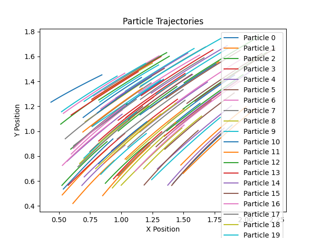

# Machine Learning-Based Force Fields for Molecular Dynamics

## Overview

This project demonstrates the implementation of **machine learning-based force fields** for particle simulations. The main goal is to accelerate force calculations in molecular dynamics (MD) simulations by replacing traditional computationally expensive methods with a machine learning (ML) model. By training a neural network on known particle positions and forces, the model predicts forces for new configurations, enabling faster simulations.

The project integrates **asynchronous MPI communications** to optimize parallel computing performance by overlapping particle position updates and data exchanges between MPI processes.

---

## Features

1. **ML-Based Force Prediction**:
   - Neural network trained to predict particle forces.
   - Significantly reduces computational cost compared to traditional methods.

2. **Parallel Computing with MPI**:
   - Asynchronous MPI communication used to overlap position updates and data exchanges.

3. **Comprehensive Results Analysis**:
   - Generates trajectory plots for visualizing particle movements.
   - Computes mean squared error (MSE) to evaluate model performance.

---

## Project Structure

```
MLFF-MD-Simulation/
├── data/
│   ├── dataset.npz              # Training data for the ML model (positions and forces)
│   ├── initial_positions.npy    # Initial positions of particles
│   ├── params.json              # Parameters used for training and simulations
│   ├── true_positions.npy       # Ground truth positions for error evaluation
├── models/
│   ├── model.pth                # Trained ML model for force prediction
├── results/
│   ├── all_positions.npy        # Particle positions at all time steps
│   ├── final_positions.npy      # Final particle positions
│   ├── positions.txt            # Simulation log with positions at each step
│   ├── trajectories.png         # Visualization of particle trajectories
├── scripts/
│   ├── analyze_results.py       # Script to analyze simulation results
│   ├── run_simulation.py        # Script to run particle simulations
│   ├── train_model.py           # Script to train the ML model
├── src/
│   ├── __init__.py              # Package initializer
│   ├── data_preprocessing.py    # Functions for data loading and preprocessing
│   ├── force_prediction.py      # ML-based force prediction module
│   ├── model_training.py        # Functions for training the ML model
│   ├── mpi_communication.py     # MPI communication utilities
│   ├── simulation.py            # Core simulation logic
├── README.md                    # Project documentation
└── requirements.txt             # Python dependencies
```

---

## Getting Started

### Prerequisites

- Python 3.8+
- MPI (e.g., OpenMPI)
- Required Python libraries (listed in `requirements.txt`)

Install dependencies with the following command:

```bash
pip install -r requirements.txt
```

---

### Workflow

#### 1. Prepare Data

Store the dataset in the `data/` folder. Example structure for the training dataset (`dataset.npz`):

```python
{
    'positions': ndarray(shape=(N, D)),  # Particle positions
    'forces': ndarray(shape=(N, D))     # Corresponding forces
}
```

#### 2. Train the Model

Train a neural network to predict forces using the training dataset:

```bash
python scripts/train_model.py --data_path data/dataset.npz --save_path models/model.pth
```

#### 3. Run the Simulation

Simulate particle dynamics using the trained model:

```bash
mpiexec -n 4 python scripts/run_simulation.py --model_path models/model.pth --steps 100 --output_file results/all_positions.npy
```

#### 4. Analyze Results

Visualize particle trajectories or compute prediction errors:

```bash
python scripts/analyze_results.py --positions_file results/all_positions.npy --save_path results/trajectories.png
```

---

## Files in the `data/` Directory

- **`dataset.npz`**: Contains particle positions and forces for training.
- **`true_positions.npy`**: Ground truth particle trajectories for validation.
- **`initial_positions.npy`**: Initial positions for simulation.
- **`params.json`**: Hyperparameters for the machine learning model.

---

## Results

### Particle Trajectories

The following plot visualizes the trajectories of particles over 100 time steps:



### Final Positions

The final positions of all particles are saved in `results/final_positions.npy` and logged in `results/positions.txt`.

---

## Future Work

- Extend simulations to 3D space for more realistic modeling.
- Implement additional ML models for better force prediction accuracy.
- Incorporate support for more complex boundary conditions.

---

## Authors and Acknowledgments

This project was developed by **Bor-Sheng Huang** and **Yuan-Jung Chang** as part of the **Scientific Computing and Visualization** course. Special thanks to the course instructors for guidance and support.

---
